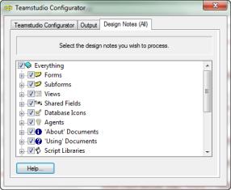

# 設計要素の選択

**[Teamstudio Configurator]** ウィンドウの **[Design Notes]** タブを使用して、処理する個々の設計要素を選択することができます。

<figure markdown="1">
  
</figure>

設計要素を選択または選択解除するには、目的の要素名の左側にあるチェックボックスを使用します。チェックマークは選択されていることを示します。

カテゴリ見出しのチェックマークを使用すると、そのカテゴリに含まれるすべての要素を選択/選択解除できます。

カテゴリ **[ すべて ]** を選択すると、すべての設計カテゴリとノートが選択されます。カテゴリ **[ すべて ]** にチェックマークが付いている場合、子カテゴリまたは要素の選択を解除すると、解除された項目が対象から除外されます。