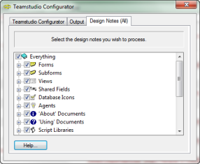

# Selecting Design Elements

You can select individual design elements for processing using the **Design Notes** tab in the Teamstudio Configurator window. 

<figure markdown="1">
  
</figure>

Select/Deselect design elements using the check box to the left of the desired element name. A checkmark indicates selection.

Use a category heading check box to select/deselect all of the elements contained within that category.

Select the **Everything** category to select all design categories and notes. If the **Everything** category is selected, de-selecting a child category or element will override (uncheck) the **Everything** selection.