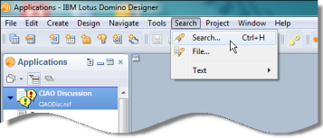
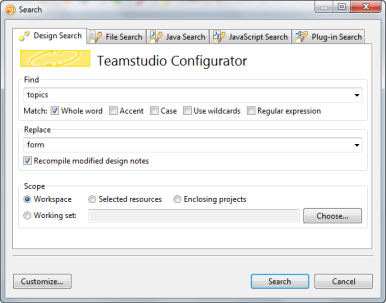

# はじめに

## Configurator を起動するには
1. Designer で、作業するデータベースを開きます。
2. ツールバーの[Configurator]ボタンをクリックするか、Designerの[検索]メニューから **[ 検索 ]** をクリックします。  
     
   [Teamstudio Configurator] ウィンドウが表示されます。 
     
   Designer の [ 検索 ] ボタンを使用した場合、[Configurator] ウィンドウの表示 はわずかに異なります。  
   

!!! note
    検索および置換パラメータ(**[ 検索文字列 ]** と **[ 置換後の文字列 ]** に指定した値)は、最後のいくつかの項目が保存されます。保存されている選択基準を選択するには、各フィールドの右側にある矢印をクリックしてください。  
    **[ 検索文字列 ]** ボックスおよび **[ 置換後の文字列 ]** ボックスには、最大 254 文字まで入力できます。 