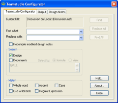

# Getting Started

## To start Configurator
1. In Designer, open the database you want to work with.
2. Click the Configurator button on the toolbar, or click **Search** from the Designer Search menu.  
     
   You see the Teamstudio Configurator window.  
     
   From the Designer Search button, the Configurator window looks slightly different.  
   

!!! note
    The last few Search and Replace parameter entries for '**Find what**' and '**Replace with**' are saved. Click the arrow to the right of the field to quickly select these criteria.  
    The **Find what** and **Replace with** boxes accept a maximum of 254 characters. 