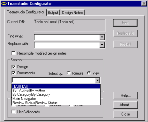

# 検索箇所の指定

**[ 設計 ]** チェックボックスをオンにすると、検索文字列に一致する文字列をデータベース設計の全域から検索できます。検索対象には、式コード、ロータススクリプト、フォームのスタティックテキスト、サブフォーム、データベースの使い方やデータベースについてのヘルプ文書、フィールドヘルプ、ポップアップ、要素タイトル(フォームやビューのタイトルなど)がすべて含まれます。つまり、ほとんどすべての場所でテキストを変更することができます。

**[ 変更された設計要素をリコンパイルする ]** チェックボックスをオンにした場合、Configurator により式とロータススクリプトコードが変更されると、構文が確認されてコードがリコンパイルされます。このため、変更により構文エラーが発生した場合、要素を保存する前にコードを修正する必要があります。

ソースコードの変更によりエラーが発生した場合、Configurator のログにエラーが記録されます。**[ すべて置換 ]** をクリックした場合に、変更によりエラーが発生すると、オリジナルのソースコードは変更されません。**[ 置換 ]**をクリックした場合に、変更によりエラーが発生すると、オリジナルのソー スコードを保存するか、エラーの原因となった変更を加えてソースコードを保存するかを選択できます。シンタックスエラーを含む要素を保存すると、その要素のコンパイルされたコード(オブジェクトコード)は保存されません。エラーのないコンパイルのオブジェクトコードのみ保存されます。

**[ 文書 ]** オプションは、テキストを含むフィールドで文字列の検索や置換を実行する場合に使用します。

!!! note
    Configurator は、フィールド名ではなく、フィールドのテキストのみを変更します。
 
次の項目内で、Configurator は検索できますが置換はできません。
* 複合アプリケーション
* 接続プロパティ
* コンポーネント
* アウトライン
* ACL

選択式(ビューの選択式と同様)を指定するか、または既存のビューを選択して、検索に含める文書を指定することができます。

## 式またはビューによる選択の指定
文書は、式またはビューにより選択できます。

### 式により文書を選択するには
[Teamstudio Configurator] タブから、[ 式による選択 ] オプションボタンをクリックします。

式で文書を選択する場合、デフォルトの式はデータベースの全文書を意味する @ALL になっています。たとえば、次の式を指定すると、メイントピックフォームで作成された全文書を選択することができます。
```
Form = "MainTopic"
```

### ビューにより文書を選択するには
[Teamstudio Configurator] タブから、[ ビューによる選択 ] オプションボタンをクリックします。 

データベース設計のビューの一覧を含むボックスが表示されます。  
目的のビューを選択します。
<figure markdown="1">
  
</figure> 
