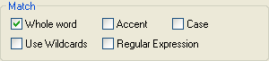

# 全単語一致検索

<figure markdown="1">
  
</figure>

**[ 全単語の一致 ]** チェックボックスをオンにすると、検索で一致した文字列がスペース、句読点で囲まれている(文字列が完全に一致する)場合のみ置換します。

たとえば、[ 全単語の一致 ] チェックボックスをオフにして、「Heading」という文字列を「Topic」という文字列で置換すると、次のような結果になります。
<table>
<tr><td>"Heading"</td><td>という文字列は置換後</td><td>"Topic"</td><td>となります。</td></tr>
<tr><td>"Headings"</td><td>という文字列は置換後</td><td>"Topics"</td><td>となります。</td></tr>
</table>

With the **Whole word** check box selected, the same search/replace operation would have the following results:
<table>
<tr><td>"Heading"</td><td>という文字列は置換後</td><td>"Topic"</td><td>となります。</td></tr>
<tr><td>"Headings"</td><td>という文字列は置換されず</td><td>"Headings"</td><td>のままになります。</td></tr>
</table>