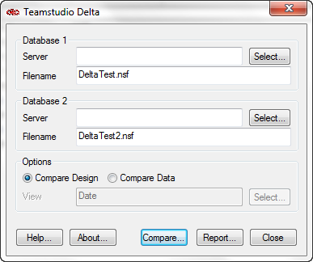
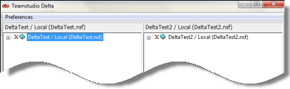
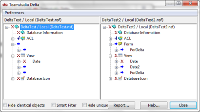
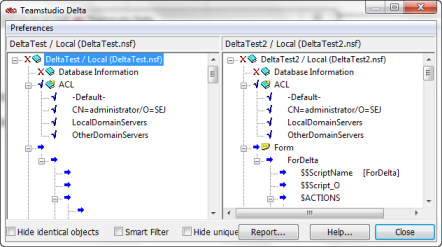

# 紹介

## 2 つの異なるデータベース内の項目を比較するには
1. [Delta] ウィンドウで、まだ選択していない場合は比較する要素または文書が存在するデータベースを選択します。
2. **[ オプション ]** 領域で、**[ 設計を比較 ]** または **[ データを比較 ]** を選択します。 **[ 設計を比較 ]** を選択した場合、ステップ 3 に進みます。  
   **[ データを比較 ]** を選択した場合、共通フィールドで並べ替えられたデータを表示するビューを指定する必要があります。
    1. **[ ビュー ]** ボックスの横にある **[ 選択 ]** をクリックし、**[ データビューの選択 ]** ウィンドウを開きます。
    2. **[ ビュー ]** ドロップダウンを展開します。
    3. 両方のデータベースで文書が一致するように、フィールドで文書を分類するビューを選択します。これにより、文書検索、およびその相違の表示が簡単になります。
    4. **[OK]** をクリックします。
3. **[ 比較 ]** をクリックします。  
     
   比較処理が終了すると、メインウィンドウが表示されます。  
     
   各データベースは別のペイン(データベース 1 が左側、2 が右側)に表示されます。データベース設計は階層構造で表示されます。  
   文書を比較すると、文書は選択したビューにより決定された順番で表示されます。親文書が子文書の上になる階層構造で表示されることがあります。文書はノートのアイコン で表示されます。  
   両ペインのウィンドウはシンクロナイズされます。したがって、一方のペインをスクロールすると、他方のペインも同じようにスクロールされます。一覧を展開するには、各ペインでプラス記号をクリックします。対応する設計要素は、常に並んで表示され、同一名で同一タイプになります。  
     
   右向きの矢印は、データベース 2 にだけ項目が存在することを示します。逆にデータベース 1 の項目に対応する項目がデータベース 2 にないとすると、データベース 2 の対応行は空白になります。左向きの矢印は、データベース 1 にだけ要素が存在することを示します
4. 下位レベルを順に表示するには、プラス記号を続けてクリックします。  
   