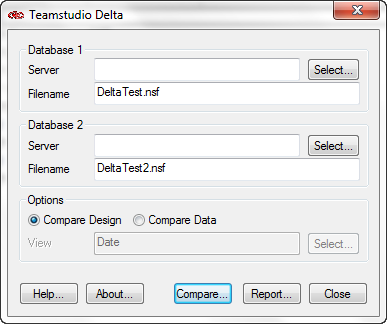
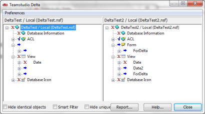
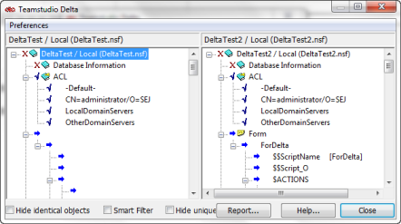

# Overview

## To compare items in two different databases
1. In the Delta window, select the two different databases whose elements or documents you want to compare, if not already selected.
2. In the Options area, select **Compare Design** or **Compare Data**. If you selected **Compare Design**, move ahead to step 3.  
   If you selected **Compare Data**, Delta requires you to specify a view that will display the data sorted on a common field.
    1. Beside the **View** box, click **Select** to open the **Select Data View** window.
    2. Expand the **View** dropdown.
    3. Select a view that categorizes documents on fields that will match documents across the two databases, making it easy for you to locate documents and show their differences.
    4. Click **OK**.
3. Click compare.  
     
   Delta's main window opens when the Delta comparison process is complete.  
     
   Each database is represented in a pane, with Database 1 on the left and Database 2 on the right. The design of the databases is represented hierarchically.  
   When comparing documents, the documents are listed in the sequence determined by the view you selected. They may be represented hierarchically, for example, with parent or main documents preceding their descendant. Documents are identified with a note icon.  
   The windows in the two panes are synchronized, so that as you scroll through one, the other scrolls with it. To expand the list, click the plus sign in either pane. Corresponding items are always listed side-by-side, have identical names, and are of the same type.  
     
   An arrow pointing right indicates that the item exists in Database 2 only. If there is no corresponding item in Database 2 to an item in Database 1, the corresponding line in database 2 is blank. An arrow pointing left indicates that the element exists in Database 1 only.
4. To drill down to successively lower levels of detail, continue clicking plus signs.
   