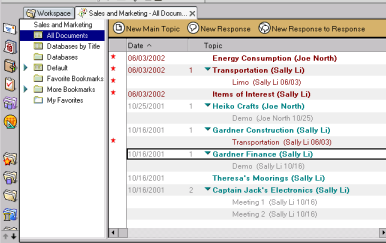
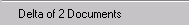

# Showing Data Document Differences from the Notes Client

Delta lets you compare two data documents without leaving their database.

## To compare two data documents from within their database
1. Open the database in Notes.
2. Select two documents in the same view to compare. (You cannot select documents from two different views.)  
   
3. Choose **Delta of 2 Documents** from the **Actions** menu in Notes. (This menu choice is unavailable until two documents are selected.)  
   
4. The **Show Differences** window opens, displaying the first document in the view in the left pane and the second document in the view in the right pane.