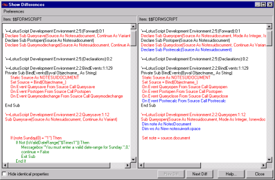

# 紹介

対応する項目に相違があることを特定できたら、それらの項目を比較して相違点を特定します。

2 つの異なる項目を比較し、相違を表示するには、いずれかのペインで項目をダブルクリックします。または、項目を右クリックしてショートカットメニューの **[ 違い ]** を選択します。
<figure markdown="1">
  
</figure>

**[ 相違の表示 ]** ウィンドウが表示され、対応する 2 つの設計要素の属性が並べて表示されます。データベース 1 の要素が左側ペインに、データベース 2 の要素が右側ペインに表示されます。

この例では、2 つのデータベース間でデータベース情報の比較が行われ、各データベースの一般属性間の相違が表示されています。

<figure markdown="1">
  
</figure>

!!! note
    テキストフォーマット以外(バイナリデータなど)で保存されているデータは、比較の際にテキストに変換されます。上記の例では、フィールドデータベース ID のオリジナルバイナリデータは、16 進データに変換されています。フィールドの中には、Delta による特別な解釈を必要とするものがあります。例では、 [ フラグ ] フィールドの後の 2 行が、Delta によるフラグの値の解釈結果です。  
    一方のデータベースのみに含まれる設計要素を選択すると、既存の要素の属性が該当するペインに表示され、もう一方のペインは空白になります。

設計要素間の構造の相違、フィールド間の相違、ロータススクリプトなどのコードを調べる場合に、Delta の「違い」機能を使用します。設計要素の相違は、テキストとして表示されます。詳細については相違の表示 を参照してください。

設計要素がフォーム、サブフォーム、ページ、または他のビジュアル設計要素である場合は、相違のビジュアルプリビューを表示することもできます。

!!! note
    Delta の [ 相違の表示 ] ウィンドウでのフォントと空白スペースの表示法を変更する場合は、[Delta のプリファレンスの設定](preferences.md) を参照してください。
    
!!! note
    「違い」機能は、同じ位置に表示される対応項目以外では使用できません。  
    対応していない2つの項目の相違を調べる場合は、まず文書を一致させてください ([要素または文書の一致](matching.md)を参照してください). 2 つの項目が極端に異なり一致できない場合は、「比較」を使用して相違を調べます ([ 要素または文書を一致させることができる状況](nomatch.md)を参照してください)。

ロータススクリプトなどコードを含む 2 つの要素を比較すると、[ 相違の表示 ] ウィンドウにはそのプログラミングコードが表示されます。
<figure markdown="1">
  
</figure>

