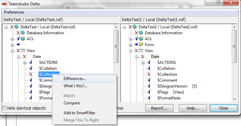
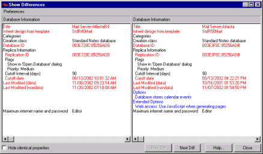
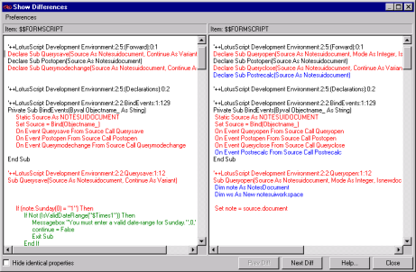

# Overview

Once you have determined which corresponding items are different, you can compare them to learn how they differ.

To compare and display the differences between two individual items, double-click the item in either pane. Alternatively, right-click the item and choose **Differences** from the shortcut menu. 
<figure markdown="1">
  
</figure>

The **Show Differences** window displays the attributes of the two corresponding design elements side-by-side. The element from Database 1 is in the left pane and the element from Database 2 is in the right pane.

In this example, we compared the Database information for each of the two databases to see the differences between each database's general attributes.

<figure markdown="1">
  
</figure>

!!! note
    Data stored in a format other than text, for example, binary data, is converted to text for the Delta comparison. In the example, the field Database ID's original binary data was converted to hexadecimal data. Some fields require special interpretation by Delta. In the example, the two lines that follow the Flag field were Delta's interpretation of the flag values.  
    If you select a design element that exists in one database but does not exist in the other, the attributes of the existing element display in the appropriate pane and the other pane is empty. 

You use Delta's Differences feature to learn the differences in the structure of two design elements or the differences in two fields, or code, such as LotusScript. These types of differences display as text.

You can also show a visual preview of differences when the design element is a form, subform, page or other visual design element.

!!! note
    See [Setting Delta Preferences](preferences.md), if you want to change how the Delta Show Differences window displays fonts and white space.
    
!!! note
    The Differences function can only be used with two corresponding, side-by-side items.  
    To learn the differences between two items that do not correspond, try Matching them first (See [Matching Elements or Documents](matching.md)). If the two items are too dissimilar to be matched, use Compare to see their differences (See [When You Can't Match Elements or Documents](nomatch.md)).

When you compare two elements that contain code, such as LotusScript, you see that programming code in the Show Differences window.
<figure markdown="1">
  
</figure>

