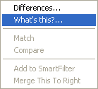
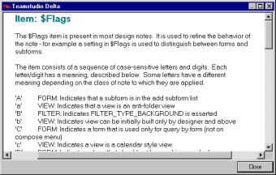

# 設計要素の説明の表示

Delta の状況依存ヘルプを使用すると、設計のさまざまな部分の説明を参照できます。

たとえば、フォーム内の $Flags 項目の意味が分からない場合、項目を右クリックしてショートカットメニューの **[ 解説 ]** を選択します。
<figure markdown="1">
  
</figure>

項目を説明するウィンドウが表示されます。
<figure markdown="1">
  
</figure>

設計要素の上にマウスを置いても、同様にツールヒントポップアップに項目の説明が表示されます。
<figure markdown="1">
  
</figure>
  
## ツールヒント機能を切り替えるには
**[ プリファレンス ] > [ ツールヒントを表示 ]** をクリックします。

!!! note
    Delta では、ヘルプトピックの最初の 128 文字だけが表示されます。全項目を表示するには、ショートカットメニューで **[ 解説 ]** を選択します。
