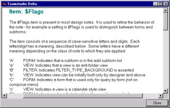
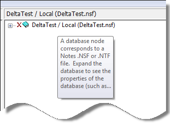

# Viewing Design Element Descriptions

You can view descriptions of the various parts of the design using Delta's context-sensitive help. 

For example, if you are not sure what the $Flags item within a form means, right-click the item and choose **What's This** from the shortcut menu. 
<figure markdown="1">
  
</figure>

You see a window with the item description.
<figure markdown="1">
  
</figure>

Hovering your cursor over a design element also gives you the item description in a ToolTip popup.
<figure markdown="1">
  
</figure>
  
## To toggle the ToolTips feature
Click **Preferences > Enable ToolTips**.

!!! note
    Delta displays the first 128 characters of the help topic. To view the entire topic, choose **What's This** on the shortcut menu.
