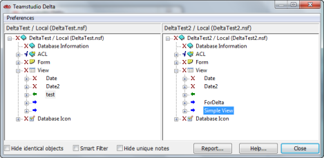

# 要素または文書の一致

設計要素の比較を行う場合、同一名で同じタイプのものが対応設計項目とみなされます。ビューでデータ文書を比較する場合は、ビューで同位置にあるものが対応データ項目とみなされます。

Delta のメインウィンドウでは、対応する設計要素またはデータ文書が 2 つのペインで同じ位置に並んで表示されます。データベース 1 の設計要素または文書が左側のペインに、データベース 2 の設計要素または文書が右側のペインに示されます。

両ペインはシンクロナイズされます。したがって、一方のペインをスクロールすると、他方のペインも同じようにスクロールされ、対応する項目が同じ位置で表示されます。内容を展開/省略するには、プラス/マイナス記号をクリックします。

## 一致を使用する理由
2 つの要素が同一タイプであっても、名前が変更されている場合、その 2 つが対応しているとは認識されません。したがって、比較の際、これらの要素は自動的に並んで一覧表示されません。Delta の「一致」機能を使用すると、その 2 つの要素を強制的に対応させて相違を表示することができます。

Delta は、ビュー内の相互に対応する文書を一致させます。比較するデータベースの 2 つのバージョン間で、ビュー内の文書の位置が変更されていると、比較の際自動的に並んで一覧表示されません。同様に、2 つの文書が相互バージョンであっても、列の並べ替えによりビューの異なった場所に表示されると、関連のない文書とみなされます。Delta の「一致」機能を使用すると、その 2 つの文書を強制的に対応させて相違を表示することができます。

一致させた 2 つの要素や文書は、Delta を終了するか、別の項目を一致させるまで維持されます。

### 2 つの要素を一致させるには
1. 片方のペインで要素のタイトルを選択します。
2. 他のペインで一致させる要素タイトルを選択します。
3. 一方の要素のタイトルを右クリックします。
4. ショートカットメニューから**[一致]**を選択します。  
   

選択した要素でビューを再表示することで、2 つの要素が一致します。一致した要素は、右側のペインでは名前なしで表示されます。
<figure markdown="1">
  
</figure>

これで、2 つの要素間の比較を行い、相違を確認することができます。詳細 については、[相違の表示 ](differences.md)を参照してくださ

選択した 2 つの要素が極端に異なる場合、一致オプションは非アクティブになります。このような場合は、「比較」機能を使用すると、2 つの要素で一致を行わずに簡単に相違を調べることができます。