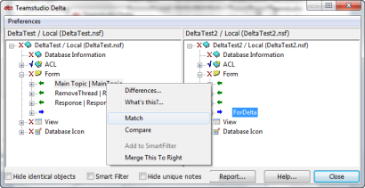
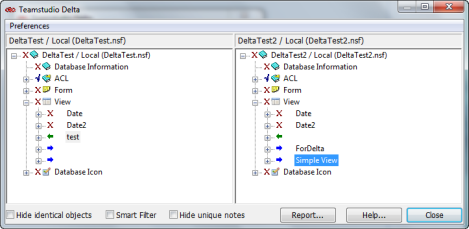

# Matching Elements or Documents

When Delta compares design elements, it identifies *corresponding design elements* as those with identical names and of the same type. When Delta compares data documents in a view, it identifies *corresponding data documents* as those in the same position in the view.

In Delta's main window, corresponding design elements or corresponding data documents display side-by-side in two panes. Design elements or documents in Database 1 display in the left pane and design elements or documents in Database 2 display in the right pane.

The two panes are synchronized, so that as you scroll through design elements or documents in one pane, the content in the other pane scrolls with it, keeping corresponding items side-by-side. You click the plus/minus signs to expand/ collapse the content.

## Why Use Matching
If two elements are of the same type, but their names have changed, Delta will not consider them corresponding and will not automatically list them side-by-side for comparison. Using Delta's Match feature, you can force the two elements to correspond so you can show the differences between the two.

Delta matches documents that correspond to each other in a view. If a document's position in the view has changed between the two versions of the database you are comparing, Delta will not be able to automatically list them side-by-side for comparison. Similarly, two documents may be versions of each other, but if column sorting causes them to appear in different positions in the view, Delta will assume they are unrelated documents. Using Delta's Match feature, you can force the two documents to correspond so you can show the differences between the two.

The two elements or documents you match remain matched until you exit Delta or you match them to something else. 

### To match two elements
1. Select an element title in one pane.
2. Select the element title you want to match in the other pane.
3. Right-click one of the two element titles.
4. Choose **Match** from the shortcut menu.
   

Delta matches the two elements by redrawing the view with the elements you selected aligned. The matched element in the right pane will display without a name.
<figure markdown="1">
  
</figure>

You can now compare the differences between the two elements. See [Viewing Differences](differences.md) for more information.

If the two elements you have selected are too dissimilar, the Match option will be inactive. Instead, you can use Compare to quickly view differences between the two elements without matching them.