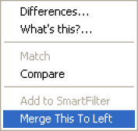

# マージによる設計の変更の共有

Delta のマージ機能を使用すると、2 つのデータベース間で選択した設計変更をすばやく共有できます。マージすると、あるデータベースのオブジェクトが、別のデータベースのオブジェクトのコピーで置き換えられます。Delta のマージはリアルタイムで行われるので注意してください。

Delta の手動マージはオブジェクトレベルで行われます。ターゲットデータベースにソースデータベースと同じ「オブジェクト」がある限り、データベースのほとんどのオブジェクトで別のデータベースにマージできます。たとえば、「従業員」というフォームのボタンを、別のデータベースの別の「従業員」フォームにマージできます。

## 2 つのデータベースの要素をマージするには
次の手順で、あるデータベースから別のデータベースへ要素をマージできます。

1. Delta にソースデータベースとターゲットデータベースを表示し、マージする要素を一方のデータベースで右クリックします。
2. 表示されるメニューから**[右にマージ]**または**[左にマージ]**を選択します。  
     
   その要素がもう一方のデータベースにマージされます。 
   
## 手動マージの一般的な用途
手動マージは、さまざまな方法で使用できます。

* 以前のバージョンのアプリケーションで行われたバグ修正や変更を新しいバージョンに移す。
* サードパーティのアプリケーションをアップグレードした後、行った変更を以前のバージョンにマージする。
* アクションボタンをフォームに追加する。