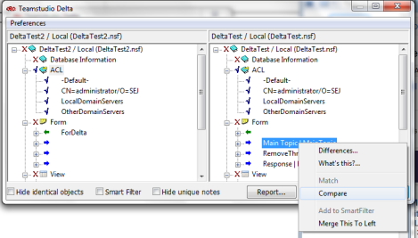
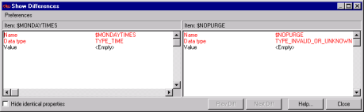
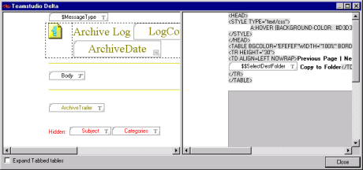

# 要素または文書を一致させることができる状況
Delta を使用すると、対応しない 2 つの設計要素および異なる設計要素の比較を行い、その相違を表示することができます。要素や文書は、さまざまなことから相違が生じます。それらの 2 つの要素は同じタイプでも、名前が異なることがあります(2 つの完全に異なるフォームなど)。また、2 つのタイプが異なることがあります(フォームとサブフォームなど)。設計要素レベルより下の階層にあることもあります(フォーム上の 2 つのフィールドなど)。また、CD レコード、リッチテキストフィールドのサブエレメントなどもこれに該当します。

これらのどの場合も、その相違を表示するには 2 つの要素を比較する必要があります。

2 つの文書間で、一致させることなく相違を確認したい場合があります。この場合、**「違い」**では対応していない文書の相違は表示されないため、**「比較」**を使用します。

**「比較」**を使用すると、2 つの設計要素または 2 つの文書が類似していない場合でも、それらの相違を表示できます。

## 一致しない 2 つの設計要素を比較するには
1. 各ペインで要素を1つずつ選択します。
2. 一方の要素のタイトルを右クリックします。
3. ショートカットメニューから**[比較]**を選択します。  
     
   **[ 相違の表示 ]** ウィンドウが開き、データベース 1 の要素が左側ペインに、データベース 2 の要素が右側ペインに表示されます。  
   
4. パネル上部にあるフォーム名のいずれかをダブルクリックすると、フォーム、サブフォーム、ページ、またはナビゲータの実際の形が表示され、相違が比較されます。  
   

他のペインの項目などと並んた項目には、**「違い」**機能を使用します。一覧内の任意の場所にある項目には、**「比較」**機能を使用します。

**「比較」**を使用してビジュアル設計要素の相違を表示した場合、まず **[ 相違の表示 ]** ウィンドウにテキストの相違が表示されます。ビジュアル相違を表示するには、**[ 相違の表示 ]** ウィンドウ内の項目をダブルクリックします。
