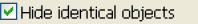
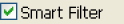
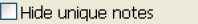

# Delta のオプション

比較結果をフィルタ処理するには、メインウィンドウの左下隅のチェックボックスを使用します。

| 
チェックボックス
 | 説明 |
| --- | --- |
|  | **[ 同一の項目を非表示 ]** チェックボックスをオン(デフォルト設定)にすると、両ペインで異なる要素および文書だけが一覧表示されます。このチェックボックスをオフにすると、完全なデータベース設計(両ペインで同じ要素、文書および異なる要素、文書の両方)が表示されます。 |
|  | **[ スマートフィルタ ]** チェックボックスをオンにすると、データベース設計を比較する上で、実質的に必要のない情報を非表示にする、またはフィルタすることができ ます。 たとえば、エージェントには、最後に実行した日時に関する情報が保存されます。この情報はデータベースのコピー間で異なる可能性がありますが、必ずしも設計に相違があるわけではありません。このような場合、**[ スマートフィルタ ]** チェックボックスをオンにすると、その属性が無視されます。 |
|  | **[ 一意要素を非表示 ]** チェックボックスをオンにすると、比較するデータベースのいずれかにのみ存在するノーツを非表示にします。 |
