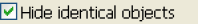
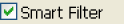
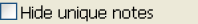

# Delta Options

You use the check boxes in the lower left corner of the main window to filter the comparison results:

| 
Check box
 | Description |
| --- | --- |
|  | Select **Hide Identical Objects** (the default) to list only elements and documents that are different in the two panes. Clear this check box to see the complete database design— elements and documents that are identical and elements and documents that are different. |
|  | Select **Smart Filter** to hide or filter information that is of no practical interest when comparing the database designs. For example, an Agent stores information about the last time it was run. This is likely to be different between two different copies of a database, but does not really mean that there are differences in the design. With **Smart Filter** selected, Delta ignores that attribute. |
|  | Select **Hide Unique Notes** to hide notes that exist in only one of the databases you are comparing. |
