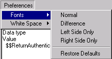
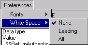

# Delta のプリファレンスの設定

Delta の **[ 相違の表示 ]** ウィンドウの表示方法を好みに合わせて設定することができます。一方または両方のペインで使用されるフォントと、Delta での空白スペースの表示方法を指定することができます。

フォントのプリファレンスは次のように設定できます。

* 同一要素のフォント定義
* 異なる要素のフォント定義
* 左ペインだけに含まれる要素のフォント定義
* 右ペインだけに含まれる要素のフォント定義
* デフォルトに戻す
<figure markdown="1">
  
</figure>

次のウィンドウでは、標準要素のフォントが表示されます。このウィンドウは、他のフォント定義と同じです。
<figure markdown="1">
  
</figure>

空白スペースの表示方法を定義することができます。ある領域に空白スペースが含まれていて、他の領域のタブ文字が含まれている場合、相違として処理されます。ただし、この相違によりコードの他の機能が影響を受けることはありません。

* **[ なし ]** をクリックすると、空白スペースの違いがそれぞれ相違として処理されます。
* **[ 行頭 ]** をクリックすると、行頭にあるすべての空白スペース文字が無視されます。
* **[ すべて ]** をクリックすると、行全体(行頭、行間、行末)の空白スペース文字が無視されます。ワード間に複数の空白スペース文字がある場合は、1 つのスペースとして処理されます。
<figure markdown="1">
  
</figure>

!!! note
    Delta では、スペースまたはタブ文字のみを空白スペースと定義しています。
