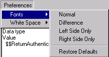
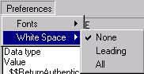

# Setting Delta Preferences

You can set preferences for how the Delta **Show Differences** window appears. You can specify the fonts used in one or both panes and you can specify how white space is seen in Delta.

You can set font preferences as follows:

* Define the font for elements that are identical
* Define the font for elements that are different
* Define the font for elements that only exist on the left side
* Define the font for elements that only exist on the right side
* Restore defaults
<figure markdown="1">
  
</figure>

The following window shows the normal font. This window is the same for other font definitions.
<figure markdown="1">
  
</figure>

You can define how white space appears. If one area contains spaces and the other contains tab characters, Delta treats this as a difference. Though this is not a difference that affects other functions of the code, it is still a difference.

* Click **None** to treat each difference in white space as a difference.
* Click **Leading** to ignore all white space characters at the start of a line.
* Click **All** to ignore white space characters throughout each line: at the beginning, between words and at the end. Multiple white space characters between words are treated as one.
<figure markdown="1">
  
</figure>

!!! note
    Delta defines white space as space or tab characters only.
