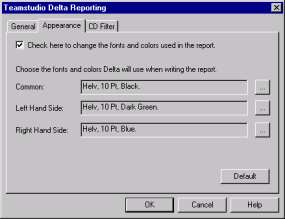
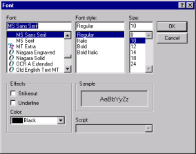

# 相違点レポートのフォントと色について

レポートで相違点を示す方法を指定するには、[ 表示 ] タブのオプションを使用します。デフォルトでは、次のようにしてフォントに MS P ゴシックが使用されます。

| テキストの色 | 説明 |
| --- | --- |
| 黒のテキスト | 両データベースの対応テキスト行が同一。 |
| 赤のテキスト | 両データベースの対応テキスト行が異なる。 |
| グリーン | データベース 1(左側)だけにテキスト行が存在する。 |
| ブルー | データベース 2(右側)だけにテキスト行が存在する。 |

デフォルトの字体や色は、[ 表示 ] タブで変更します。 
<figure markdown="1">
  
</figure>

## フォントを変更するには
1. レポートウィンドウの**[表示]**タブから、ウィンドウの上部にあるチェックボックスをオンにします。
2. さらに変更するフォント定義欄の右側にある省略記号「...」ボタンをクリックします。  
   [ フォント ] ウィンドウが表示されます。  
   
3. 希望どおりにフォントを変更します。
4. **[OK]** ボタンをクリックして変更を適用します。