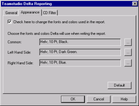

# About Difference Report Fonts and Colors

You use options on the Appearance tab to specify how Delta indicates differences in the report. By default, Delta uses the Helv font as follows:

| Text Color | Description |
| --- | --- |
| Black | Corresponding lines of text in both databases are identical. |
| Red | Corresponding lines of text in both databases are different. |
| Green | Line of text appears in Database 1 (on left) but not in Database 2. |
| Blue | Line of text appears in Database 2 (on right) but not in Database 1. |

You can change these default typefaces and colors on the **Appearance** tab.
<figure markdown="1">
  
</figure>

## To change any one of the font typefaces
1. From the **Appearance** tab of the Reporting window, click the check box at the top of the window.
2. Click the ellipse "..." button to the right of the appropriate font definition.  
   You see the font window.  
   
3. Make the font changes you want.
4. Click **OK** to accept the changes.