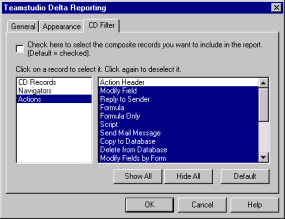

# 重要度の低いデータのフィルタ処理

CD レコードには、フォームやサブフォームの設計レイアウトのリッチテキスト定義が保存されます。これらの定義は性質上かなり複雑なため、フォームのレイアウトを少し変更するだけでも、CD レコードレベルではかなりの変更になります。[CD フィルタ ] タブでは、2 つの設計要素や 2 つの文書を比較する際に意味のない、重要度の低いデータ(単純なフォームレイアウトの変更など)をフィルタ処理できます。

!!! note
    CD フィルタは上級レベルのオプションです。設計要素の内部構造を十分に理解した上で使用してください。
    
CD フィルタは、スマートフィルタから初期設定を取得します。次のようにして、1 つのレポートのフィルタに変更を加えることができます。

## CD レコードをフィルタ処理するには
レポートで CD レコードを非表示にするには、**[ フィルタを適用し、下記で選択されている複合レコードをレポートに含む]** チェックボックスをオンにします。
<figure markdown="1">
  
</figure>

左側の一覧ボックスには、次のオブジェクトタイプが一覧表示されます。

| オブジェクトのタイプ | 説明 |
| --- | --- |
| CD レコード | $BODY などのリッチテキスト用オブジェクト |
| ナビゲータ | ナビゲータ用オブジェクト |
| アクション | フォームやビューでのアクション用オブジェクト |

右側の一覧ボックスには、選択したオブジェクトタイプの CD レコードす べてが一覧表示されます。

* **[ すべて表示 ]** をクリックすると、選択したオブジェクトタイプの CD レコードすべてを選択できます。
* **[ すべて非表示 ]** をクリックすると、選択したオブジェクトタイプの CD レコー ドすべてを解除できます。
* **[ デフォルト ]** をクリックすると、すべてのオブジェクトタイプに Delta デフォ ルト CD レコードが使用できます。

CD レコードのタイプについては、*HCL Lotus Notes C API マニュアル*で定義 されています。通常は、デフォルト設定を変更する必要はありません。

!!! note
    カスタマイズした CD フィルタの選択内容は保存されないので注意してください。次回 Delta でレポートを作成する際、CD フィルタをカスタマイズし直す必要があります。
    
CD フィルタの使用方法の詳細については、[スマートフィルタの設定](smartfilter.md)を参照してください。

!!! note
    CD レコードの選択内容を 1 つのオブジェクトタイプだけにカスタマイズするには、まず [ デフォルト ] をクリックします。これによって、すべてのオブジェクトタイプがデフォルト設定になります。その後、目的のオブジェクトタイプを選択し、カスタマイズします。オブジェクトタイプをカスタマイズした後に [ デフォルト ] をクリックすると、選択内容がデフォルト設定に戻ってしまいます。
