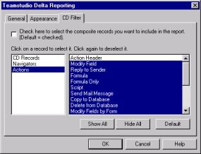

# Filtering Low-level Information

CD records store the rich text definitions of form and subform design layouts. They are complex by nature. Making even a small change in the layout of a form can cause significant differences at the CD record level. From the CD Filter tab, you can filter out low-level information that is not significant in comparing two design elements or two documents, for example, differences that show up as a result of a simple form layout change.

!!! note
    Working with the CD Filter is an advanced option. Use the CD Filter only if you understand the internal structure of a design element.
    
The CD filter gets its initial settings from the Smart Filter. You can make changes in the filter for a single report as follows:

## To filter CD records
To filter CD records in the report, select the **Check here to select the composite records you want to include in the report** check box.
<figure markdown="1">
  
</figure>

The list box on the left lists the following container types:

| Container Type | Description |
| --- | --- |
| CD Records | A container for rich text such as $BODY |
| Navigators | A container for navigators |
| Actions | A container for actions on forms and views |

The list box on the right lists all the CD records for the selected container type.

* Click **Show All** to select every CD record for the selected container type.
* Click **Hide All** to clear any selections for the selected container type.
* Click **Default** to use Delta's default CD record selection for all container types.

The various types of CD records are defined in the HCL Lotus Notes C API manual. For most users, Delta's default settings are sufficient and you will not need to change them.

!!! note
    Keep in mind that the custom CD Filter selections you make are not saved. You must re-customize CD Filter the next time you create a report with Delta.
    
See [Configuring the Smart Filter](smartfilter.md) for information on how to use the CD Filter.

!!! note
    If you are customizing the CD record selection for only one container type, click **Default** before you begin. This sets up the default selection for all container types. You can then select the container you want to customize and proceed. If you click **Default** after you customize the selection for a container type, that container type's selection reverts to the default.
