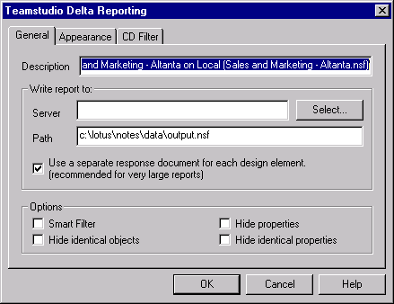

# 紹介

データベースの設計要素や文書の相違すべてを一覧表示したレポートの保 存、および印刷を行うことができます。レポートの内容が極端に細かい、あるいは不十分な場合は、[Teamstudio Delta レポート ] ダイアログボックスの [一般]タブのオプション([Delta のオプション](reportoptions.md)) や[CDフィ ルタ ] タブの設定を使用して、結果をフィルタ処理できます ([重要度の低いデータのフィルタ処理](reportfilter.md))。

文書の相違を印刷する場合は、必ず[ データ文書レポートの簡略化](reportdata.md)を参照してください。

## 相違点レポートを作成するには
相違点レポートを作成するには、レポートの説明と出力データベースの場所を指定します。次に、レポート結果をフィルタ処理または変更するオプションを指定します。

1. 相違点レポートを作成するには、Deltaメインウィンドウから[レポート]をクリックします。[Teamstudio Delta レポート ] ウィンドウの **[ 全般 ]** タブが表示されます。  
     
   **[ 説明 ]** ボックスでは、比較されるデータベース名に基づき、レポート用にデフォルトの説明が入力されます。このタイトルで、出力データベース(ノーツデータベース)のレポート文書が識別されます。
2. オプションとして、デフォルトの説明を独自の説明に置き換えます。レポートを複数回実行する予定の場合、レポートを生成するたびに、異なるレポートの説明(日時を含めるなど)を入力するようにしてください。
3. **[ レポートの場所 ]** セクションで、**[ 選択 ]** をクリックします。  
   レポートテンプレートに基づくデータベースの一覧が表示されます。  
   

     
Note

     
レポートテンプレート名は TMSLogs、ファイル名は <b>tmslogs.ntf</b> です。

   

4. 既存のデータベースを選択するか、または新しいデータベースサーバーのパス名を指定します。  
   デフォルトでは、2 つの設計要素、または 2 つの文書を比較するごとに、別個の文書が作成されます。これにより長い Delta レポートの参照が容易になります。  
   Ifデータベースが小さい場合は、レポートを単一文書として作成することができます。
5. レポートを単一文書にする場合、**[各設計要素に別の返答文書を使う]**チェックボックスをオフにします。  
   

     
Note

     
このチェックボックスをオフにすると、すべての設計要素や文書(Delta で比較する項目による)が 1 つのレポートに含まれるので、非常に長いレポートになる場合があります。

   

6. **[ オプション ]** セクションで、表で説明するように、表示されたレポート項目をフィルタ処理するオプションをクリックして選択します。
7. Click **OK**.