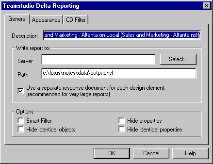

# Overview

You can save and print a report listing all of the design element or document differences in a database. If the report provides too much or not enough detail, you can filter the results using the **Options** on the **General** tab ([Delta Options](reportoptions.md)) on the Teamstudio Delta Reporting window, or the settings on the CD Filter tab ([Filtering Low-level Information](reportfilter.md)).

If you are printing document differences, be sure to read [Simplifying Data Document Reports](reportdata.md).

## To create a Difference Report
To create a Difference Report, you specify the report's description and output database location. Then you specify any options you want that will filter or change the report results.

1. To create a Difference Report, choose Report from the Delta main window. You see the General tab of the Teamstudio Delta Reporting window.  
     
   In the **Description** box, Delta provides a default description for the report, based on the names of the databases being compared. This title identifies the report document in the output database, which is a Notes database. 
2. Optionally, replace the default description with your own description. If you plan to run a report more than once, consider providing a different report description, perhaps including the date and time, each time you generate the report. 
3. In the **Write report to** section, click **Select**.  
   You see a list of databases based on the reports template. 
   

     
Note

     
The reports template name is TMSLogs and the file name is <b>tmslogs.ntf.</b>

   

4. Select an existing database or specify a new database server\pathname.  
   By default, Delta creates a separate document for each comparison of two design elements or of two documents. This makes it easier for you to navigate through large Delta reports.  
   If your database is small (or if you prefer) you can create the report as a single document.
5. If you want the report as a single document, clear the **Use a separate response document for each design element** check box.
   

     
Note

     
Remember that if you clear this check box, your report may be extremely long, because all design elements or documents (depending on what Delta is comparing) are contained within one report document.

   

6. In the **Options** section, click to select the options you want that will filter the report items displayed, as described in the table.
7. Click **OK**.