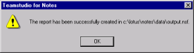
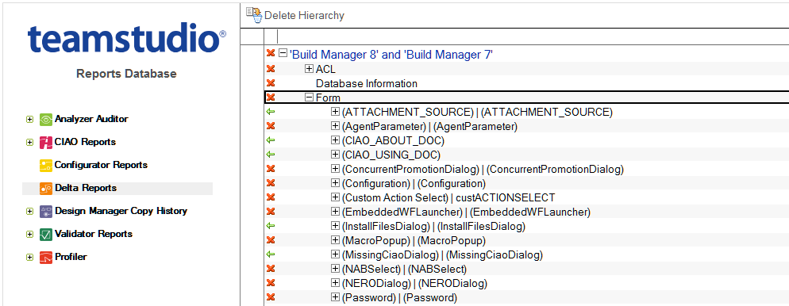
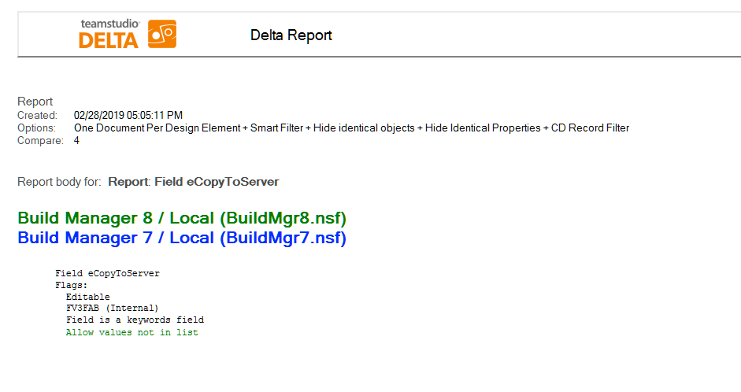

# レポートの表示

[Teamstudio Delta レポート ] ウィンドウで任意のオプションを設定したら、 [OK] ボタンをクリックし、レポートを作成します。レポートが作成されている間、ステータスバーが表示されます。完了時には、確認メッセージが 表示されます。
<figure markdown="1">
  
</figure>

Toレポートを表示するには、レポートを保存した出力データベースを開きます。次に、レポート文書を検索して開きます。
<figure markdown="1">
  
</figure>

各項目の横のアイコンは、項目が同一であるか、異なるかを示しています。 三角アイコンをクリックすると、ビュー内をドリルダウンできます。項目のレポートを表示するには、その項目をダブルクリックします。

レポートの上部には、このレポートの生成時に有効であったレポートオプションが表示されます。レポート本体では、テキストがデフォルト設定の色、または [ 表示 ] タブで選択した色で表示されます。
<figure markdown="1">
  
</figure>

