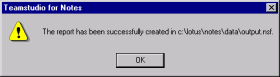
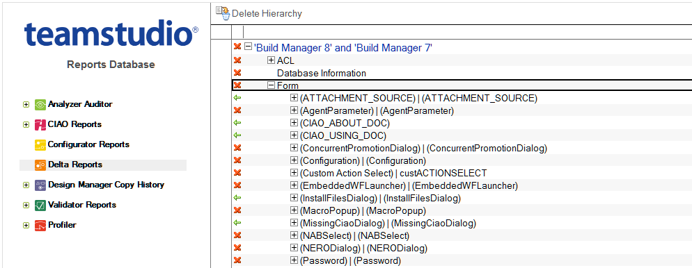
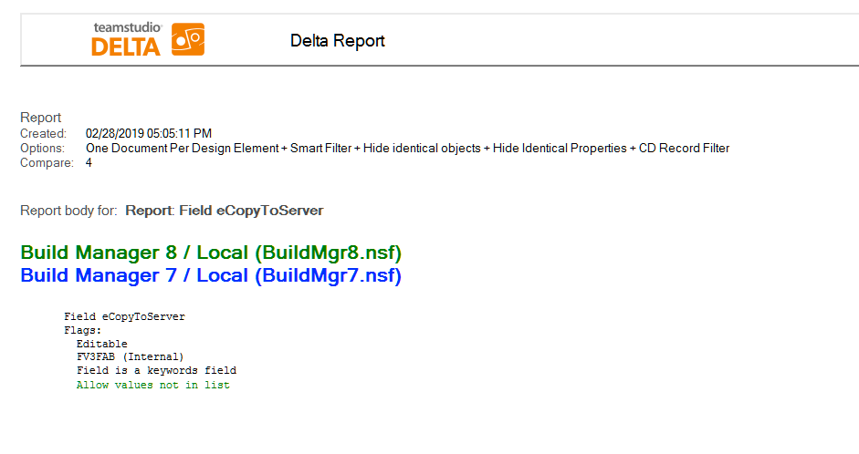

# Viewing Reports

After you set up any options (See [Report Options](reportoptions.md)) on the Teamstudio Delta Reporting window, click **OK** to generate the report. A status bar appears while the report is generated. Upon completion, you see a confirmation message. 
<figure markdown="1">
  
</figure>

To view a report, open the output database where you stored the report. Then locate and open the report document. 
<figure markdown="1">
  
</figure>

The icons beside each item tell you whether items are identical or different.You can drill down within the view by clicking twisties. You double-click an item to see its report.

At the top of the report you see the report options in effect when this report was generated. Within the body of the report, you see the text in the default colors or the colors you selected on the Appearance tab.
<figure markdown="1">
  
</figure>

