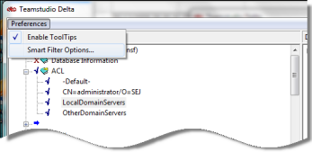
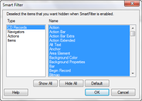

# Smart Filter

You use Smart Filter to hide items you don't want to see when viewing the results of a comparison. First, you add an item to the Smart Filter. Then you enable Smart Filter.

## To add an item to the Smart Filter list
1. Right-click the item or CD record's name to display the shortcut menu.
2. Choose **Add to Smart Filter**.  
   When Smart Filter is enabled, Delta hides the item or CD record.

## Configuring the Smart Filter
Delta filters a standard set of element items and fields when the Smart Filter check box is selected on Delta's main window.

You can customize the Smart Filter to filter only what you specify. These element items and fields include:

* CD Records (for example, individual paragraph records or text records)
* Particular design element fields (for example, $$$FormScript_O or $$SCRIPT_O)
* Anything you have added with the **Add to Smart Filter** feature

### To configure the Smart Filter
1. Click **Preferences > Smart Filter Options**.  
     
   You see the Smart Filter window. Highlighted elements are always visible.  
   
2. Select a type.
3. Do one of the following:
    * Deselect (unhighlight) the elements you want to hide.
    * Click **Show All** to select (highlight) all elements, so that all will appear when the Smart Filter is turned on.
    * Click **Hide All** to deselect (turn off highlighting) all elements, so that none will appear when the Smart Filter is turned on.
    * Click **Default** to accept Smart Filter's defaults. This is information that is typically of no interest to a developer. This restores factory settings.