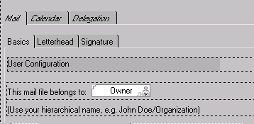
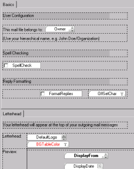

# Showing Tabbed Tables

By default, tabbed tables within a form are hidden and display the same as they appear on the actual form, one on top of the other. 
<figure markdown="1">
  
</figure>

To view the content on each tab, select the **Expand Tabbed tables** check box. 

This lists each tab one below the other. You scroll down to review the content on each tab. 
<figure markdown="1">
  
</figure>
