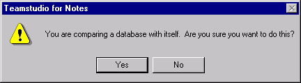

# Delta の使用 

最初に、Delta は次のようにして使用できます。

## 1 つのデータベース内の設計要素を比較するには
1. Designer で、比較するデータベースを 1 つ開きます。
2. ツールバーの[Delta]ボタンをクリックします。  
   **[Delta]**ウィンドウが表示され、**[データベース1]**と**[データベース2]**フィール ドの両方に、開いたデータベースのファイル名が表示されます。  
     
   Delta では、2 つの異なるデータベースを比較することも、同一のデータベースを比較することもできます。
   

     
note

     
データベースを開かずに Delta を起動すると、データベース 1 とデータベース 2 の [ ファイル名 ] フィールドには、前回比較したデータベースが表示されます。ただし、Delta を初めて使用する場合、両方のデータベースフィールドは空白になります。

   

3. [Delta] ウィンドウで、まだ選択していない場合は比較する設計要素が存在するデータベースを選択します。
4. **[ オプション ]** 領域で、**[ 設計を比較 ]** を選択します。
5. **[ 比較 ]** をクリックします。次のメッセージが表示されます。  
   
6. **[ はい ]** をクリックします。  
   比較処理が終了すると、メインウィンドウが表示されます。データベース設計は階層構造で表示されます。
7. **[ 同一の項目を非表示 ]** をオフにします。  
   両ペインのウィンドウはシンクロナイズされます。したがって、一方のペインをスクロールすると、他方のペインも同じようにスクロールされます。初めて表示されるペインでは、ヘッダーは常に省略された状態になっています。要素一覧を展開/省略するには、各ペインでプラス/マイナス記号をクリックします。対応する要素は常に同じ位置で並んで表示されます。対応する設計要素は、常に同一名で同一タイプになります。  
     
   右向きの矢印は、データベース2にだけ要素が存在することを示します。逆にデータベース 1 の要素に対応する要素がデータベース 2 にないとすると、データベース 2 の対応行は空白になります。左向きの矢印は、データベース 1 にだけ要素が存在することを示します。  
   下位レベルを順に表示するには、プラス記号を続けてクリックします。すべて展開するには、テンキーのアスタリスクキーを押します。
