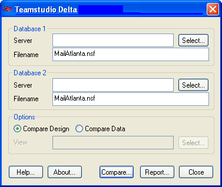
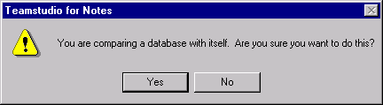
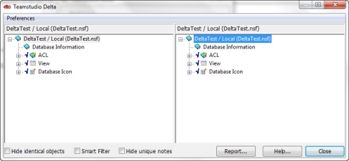

# Using Delta

You can begin using Delta as follows:

## To compare design elements within a single database
1. In Designer, open one of the databases you want to compare.
2. Click the Delta button on the toolbar.  
   You see the Delta window, with both the **Database 1** and **Database 2** fields populated with the file name of the database you have open. 
     
   You can compare two different databases or compare one database with itself.
   

     
note

     
If you start Delta without a database open, Delta starts with the databases last compared in the Database 1 and Database 2 File name fields. However, if you have not used Delta before, the program starts with both database fields blank.

   

3. In the Delta window, select the database whose design elements you want to compare, if not already selected.
4. In the **Options** area, select **Compare Design**.
5. Click **Compare**. You see the following message.
   
6. Click **Yes**.  
   Delta's main window opens when the Delta comparison process is complete. The design of the databases is represented hierarchically.
7. Uncheck **Hide Identical Objects**.  
   The windows in the two panes are synchronized, so that as you scroll through one, the other scrolls with it. The display always starts with all headings collapsed. To expand/collapse the list of elements, click the plus or minus sign beside a heading in either pane. Corresponding elements are always listed side-by-side. Corresponding design elements always have identical names and are of the same type.  
     
   An arrow pointing right indicates that the element exists in Database 2 only. If there is no corresponding element in Database 2 to an element in Database 1, the corresponding line in database 2 is blank. An arrow pointing left indicates that the element exists in Database 1 only.  
   To drill down to successively lower levels of detail, continue clicking plus signs. To expand everything, press the asterisk key on the numeric keypad.
