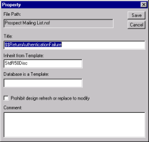

# コメントの追加とプロパティの変更

設計要素にコメントを追加できます。要素を選択すると、Design Manager の [ コメント ] フィールドにコメントが表示されます。設計要素のプロパティを変更することもできます。たとえば、**[ タイトル ]**、**[ テンプレートから引き継ぐ ]** の名前、または再設計または設計の置換操作により要素のコードが変更されないようにするフラグなどです。

## コメントを追加して、設計要素のプロパティを変更するには
1. 右側のペインで、コメントを追加する要素を右クリックします。 ショートカットメニューが表示されます。
2. ショートカットメニューから、**[プロパティ]**を選択します。  
   **[ プロパティ ]** ウィンドウが表示されます。  
   
3. 次のように入力します。  
   
<table>
     <tr><th>項目</th><th>説明</th></tr>
     <tr><td>タイトル</td><td>要素、アクション、またはデータベースの名前</td></tr>
     <tr><td>テンプレートから引き継ぐ</td><td><このテンプレートの継承元となるテンプレート</td></tr>
     <tr><td>更新時に再設計/設計の置換を禁止する</td><td>設計操作または再設計操作により設計要素のコードが変更されないようにする場合は選択</td></tr>
     <tr><td>コメント</td><td>コメントとして使用するテキスト</td></tr>
   </table>  
   データベースがテンプレートである場合は、<b>[ テンプレートのデータベース ]</b> フィールドにテンプレート名が表示されます。

4. **[ 保存 ]** をクリックします。