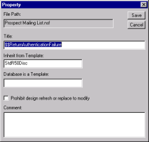

# Adding Comments and Changing Properties

You can add comments to a design element. The comments display in Design Manager's Comment field when you select the element. You can also change design element properties, for example, the Title, the Inherit from Template name or the flag that stops a design refresh or replace operation from changing the element's code. 

## To add a comment and change the properties of a design element
1. In the right pane, right-click the element you want to add the comment for. You see the shortcut menu.
2. From the shortcut menu, choose **Properties**.  
   You see the **Property** window.  
   
3. Enter the following:  
   
<table>
     <tr><th>Item</th><th>Description</th></tr>
     <tr><td>Title</td><td>Element, action or database name</td></tr>
     <tr><td>Inherit from Template</td><td>The template from which you want this template to inherit</td></tr>
     <tr><td>Prohibit design refresh or replace to modify</td><td>Select to ensure the design element's code remains unchanged by any design or refresh operation</td></tr>
     <tr><td>Comment</td><td>Any text you wish to use as a comment</td></tr>
   </table>  
   If the database is a template, the template name will appear in the <b>Database is a Template</b> field.

4. Click **Save**.