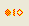

# 要素の比較

Design Manager を使用すると、同一ペインまたは異なるペインにある 2 つの設計要素を比較できます。たとえば、ライブラリにある要素のバージョンが、データベースにある同一要素の更新されたバージョンであることを確認する場合などに、この機能を使用して両要素を比較することができます。同様に、異なる 2 つのライブラリにある同名の 2 つの要素を比較することができます。

## 2 つの設計要素を比較するには
比較対象となる 2 つの要素を選択し(同一ペインにある場合は **CTRL** キーを 使って選択)、**[ ツール ]** メニューの **[ 要素を比較 ]** を選択します。

 **[ ツール ]** メニューの **[ 要素を比較 ]** のショートカットとして、**[ 要素を比較 ]** ツールバーボタンを使うこともできます。
 