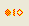

# Comparing Elements

You can use Design Manager to compare any two design elements, either in the same pane or in different panes. For example, if you believe that the version of an element in a library may be an updated version of the same element in the database, use Compare Elements to compare the two elements. Similarly, you can compare two elements with the same name in two different libraries.

## To compare two design elements
Select the two elements to be compared (use the **CTRL** key if they are in the same pane), and then choose **Compare Elements** from the **Tools** menu.

 You can also use the **Compare Elements** toolbar button as a shortcut to the **Compare Elements** command on the **Tools** menu. 
 