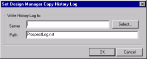
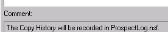
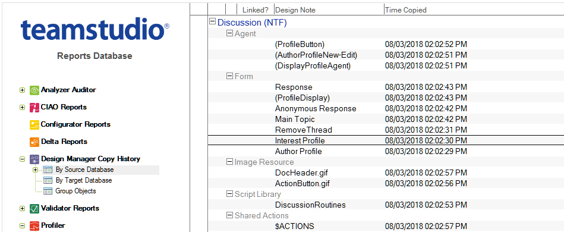

# コピー履歴ログの設定

Design Manager では、要素がソースライブラリファイル(データベースまた はテンプレート)からターゲットデータベースにコピーされるたびに、コピー履歴ログにそのアクションが記録されます。またターゲットデータ ベースでグループオブジェクトを作成、編集した場合もその情報が記録さ れます。コピー履歴ログはノーツのデータベースです。

## コピー履歴ログを設定するには
1. **[ ツール ]** メニューから **[ コピー履歴ログの設定 ]** を選択してください。 **[Design Manager コピー履歴の設定 ]** ウィンドウが表示されます。
2. **[ 選択 ]** をクリックして既存データベースを検索するか、**[ パス ]** フィールドに パスと新規データベース名を入力します。  
   
3. **[OK]** をクリックします。  
   指定したデータベースが存在しない場合は、自動的に作成されます。  コピー履歴ログの設定が終わると、次のような確認メッセージがログペインに 表示されます。  
   
 
コピー履歴が設定されると、ソースデータベースやテンプレートからター ゲットデータベースに設計要素を貼り付けたり、ドラッグ・アンド・ドロッ プを行ったりするたびに、Design Manager によりコピー履歴ログデータベー スに文書が作成されるようになります。さらに、発生したアクティビティ およびそのアクションの責任者に関する情報も記録されます。

グループオブジェクトをソースデータベースからターゲットデータベース にコピーする場合は、そのグループ内の要素だけがコピーされます。ター ゲットデータベースでもグループ化を行う場合は、グループを再度作成す る必要があります。コピー履歴ログデータベースでは、グループオブジェ クトの構成要素が **[ ソースデータベース別 ]**、**[ ターゲットデータベース別 ]** の両ビューで表示されます。要素がグループの一部としてコピーされてい る場合、その要素の文書を開くと、**[ アクション ]** フィールドにグループとしてコピーされたオブジェクトが読み込まれ、オリジナルグループオブ ジェクト名の一覧が表示されます。

コピー履歴ログデータベースの [ グループオブジェクト ] ビューは、グルー プオブジェクトの作成、編集時の履歴を表示するもので、コピー時の履歴 を表示するものではありません。

コピー履歴を表示するには、ノーツのワークスペースからコピー履歴ログを開きます。
<figure markdown="1">
  
</figure>

表示されるビューは次のとおりです。

| ビュー | 説明 |
| --- | --- |
| ソースデータベース別 | ソースデータベースからコピーされたオブジェクトのコピー履歴を 表示します。詳細を表示するには、文書をダブルクリックします。 |
| すべてのターゲット | 要素のコピー先を表示します。 |
| ターゲットデータベース別 | ターゲットデータベースにコピーされたオブジェクトのコピー履歴 を表示します。詳細を表示するには、文書をダブルクリックします。 |
| グループオブジェクト | グループオブジェクトの作成、編集履歴を表示します。詳細につい ては、 コピー履歴ログの設定を参照してください。 |

!!! note
    コピー履歴ログでは、テンプレートにリンクする要素が緑色のチェックマー クで示されます。Design Manager の右側のペインでは、この要素が太字で表 示されます。

## コピー履歴ログ文書の例
次に、コピー履歴ログの例を示します。
<figure markdown="1">
  
</figure>

この例では、要素がソースデータベースの「ディスカッションビュー」と 呼ばれるグループの一部を構成していたことがわかります。この要素に関 する情報はコピー履歴ログ文書に記録されます。

コピー履歴ログ文書には次の情報が含まれます。

* 履歴イベントとして記録されるユーザーアクション
* グループオブジェクト名(要素がグループオブジェクトを構成していた場合)
* 設計要素の名前とタイプ
* ソースおよびターゲットデータベース両方の UNID
* 要素のコピー元のソースデータベースに関する情報
* 要素のコピー先のターゲットデータベースに関する情報
* 要素をコピーしたユーザー
* 要素のコピー日時
