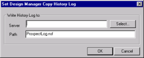
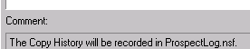
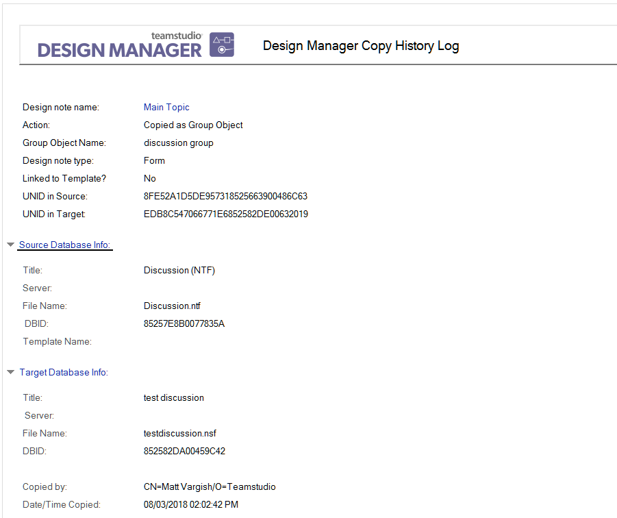

# Setting the Copy History Log

Each time an element is copied from a source library file (database or template) to one or more target databases, Design Manager records that action in the *Copy History Log*. The Copy History Log records information about group objects each time you create or edit a group object in the target database. The Copy History Log is a Notes database.

## To set the Copy History Log
1. Choose **Set Copy History Log** from the **Tools** menu. You see the **Set Design Manager Copy History** window.
2. Click **Select** to locate an existing database, or enter a path and a new database name in the **Path** field.  
   
3. Click **OK**.  
   If the database does not exist, Design Manager creates it.  
   When Design Manager finishes setting up the Copy History Log, you see a confirmation in the Log pane.  
   
 
Once set up to record the copy history, Design Manager creates a document in the copy history log database each time you paste or drag-and-drop a design element from a source database or template to one or more target databases. Design Manager records, among other data, what activity occurred and who was responsible for the action.

When a Group Object is copied from a source database to one or more target databases, only the elements within that group are copied. If you want to group them in the target database(s) as well, you must create the group again. The Copy History Log database shows the individual elements that make up the Group Object in both the **By Source Database** and the **By Target Database** views. If you open a document for an individual element, and that element was copied as part of a group, the Action field reads **Copied as Group Object** and lists the original group object name.

The **Group Objects** view in the Copy History Log database shows the history of group objects as they are created and edited, but not as they are copied.

To view copy history, open the Copy History Log from your Notes workspace.
<figure markdown="1">
  
</figure>

These are the views:

| View | Description |
| --- | --- |
| By Source Database | Shows the copy history of objects copied from the source database. Double click a document for more detail. |
| All Targets | Shows where an element has been copied. |
| By Target Database | Shows the copy history of objects copied to the target database(s). Double click a document for more detail. |
| Group Objects | Shows the history of group objects when they are created or edited. |

!!! note
    Template-linked elements appear in the Copy History Log with a green checkmark. They appear bolded in the Design Manager right pane.

## Copy History Log document example
The following is an example of the **Copy History** Log.
<figure markdown="1">
  
</figure>

In this example, the element was originally part of a group object called "discussion group" in the source database. Information is recorded in a **Copy History Log** document for that element.

The **Copy History Log** document provides the following information:

* The user action (copy) causing the history event to be recorded
* The group object name, if the element was originally part of a group object
* The design element name and type
* The UNID in both the source and target databases
* Information about the source database where the element was copied from
* Information about the target database where the element was copied to
* Who copied the element
* The date and time the element was copied
