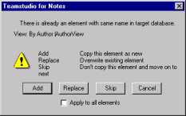

# Copying Design Elements Using Drag-and-Drop

You can use drag-and-drop to copy design elements, along with their dependencies, from an open library template or database into an open database. (See [Identifying Dependencies](dependencies.md) for more information on dependencies.)

## Copying Actions
You can copy actions from the left pane to the right pane using drag-and-drop or by clicking the blue arrow buttons.

* If you drag and drop an action onto a database name, the action is copied into the Shared Actions note. Design Manager creates a Shared Actions note if one does not already exist.
* If you drop an action onto a form or view, the action reference is copied into that form or view.
* When you copy an Action reference from a form, for example, Teamstudio Design Manager looks up the shared action, then creates a copy in your destination form that is not shared.

## To copy an element from the left pane to an open database 
See [About Template Inheritance](inheritance.md), before you begin copying.

* To copy an element from the left pane into the open database in the right pane, click the element in the left pane, and then drag it into the right pane.
 
!!! note
    You cannot copy from the database in the right pane to the template or database in the left pane.  
    When using drag and drop, you can only copy into one target database. 
 
If you are using the Copy History Log feature (See [Setting the Copy History Log](copyhistory.md)), each copy activity from Design Manager is recorded.

## Copying Duplicate Elements
Design Manager checks the target database to determine if elements with the same name already exist. It compares the title and aliases, not the design. When it finds the same element, you see the following message:
<figure markdown="1">
  
</figure>

Then you can choose from the following options:

| Button/Check box | Description |
| --- | --- |
| Add | Add another copy of the element. |
| Replace | Replace existing element with new element. |
| Skip | Don't copy the element. Move on to the next (only available when multiple elements are selected to copy). |
| Cancel | Cancel the operation. |
| Apply to all elements | Selected option (above) is applied to all duplicate elements found (only available when multiple elements are selected to copy). |