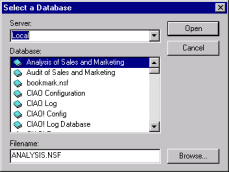

# データベースを開く

Design Manager を使用すると、要素を追加するデータベースを開くことができます。右側のペインに、データベース要素が表示されます。

## データベースを開くには
1. **[ データベース ]** メニューから **[ 開く ]** を選択します(または、**[ データベース ] > [ 最近使ったファイル ]** をクリックして、最近使用した 10 個のデータベースから選択します)。
   ローカルデータディレクトリにあるデータベースとテンプレートの一覧が表示されます。  
     
   **[ データベース ] **メニューの **[ 開く ]** のショートカットとして、**[ データベー スを開く ]** ツールバーボタンを使うこともできます。
2. 開くデータベースを選択します。
3. **[ 開く ]** をクリックします。  
   右側のペインに、データベース要素が表示されます。  
   
 
!!! note
    左側のペインでショートカットメニューを使用して、選択したライブラリを右側のペインで開いて変更することができます。
