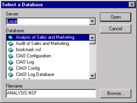
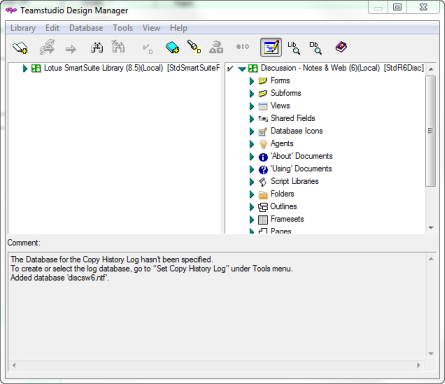

# Opening A Database

With Design Manager you can open a database you want to add elements to. The database elements display in the right pane.

## To open a database
1. Choose **Open** from the **Database** menu (or click **Database > Recent Files** to select from the last ten databases opened).  
   You see a list of databases and templates in your local data directory.  
     
   Use the **Open Database** toolbar button as a shortcut to the **Database > Open** command.
2. Select the database you want to open.
3. Click **Open**.  
   You see the database elements in the right pane.  
   
 
!!! note
    Use the right-click menu in the left pane to open the selected library in the right pane where you can change it.
