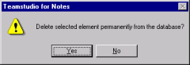

# 要素の削除

Design Manager でデータベース設計にある要素を削除できます。削除する要素を選択し、**DEL** キーを押します。要素が削除される前に、削除の確認を求めるプロンプト画面が表示されます。
<figure markdown="1">
  
</figure>

!!! note
    データベースをノーツデザイナークライアントで開いていると、Design Manager を終了しても要素表示の自動更新は行われません。F9 キーを押すと、ノーツデザイナーの設計要素のビューを更新できます。