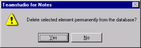

# Deleting Elements

You can delete an element in a database design from within Design Manager. Select the element you want to delete and press the **DELETE** key. Design Manager prompts you for confirmation before it deletes the element.
<figure markdown="1">
  
</figure>

!!! note
    If you have the database design open in the Notes Designer client, the view of elements will not be automatically refreshed when you exit Design Manager. You can refresh a view of design elements in Notes Designer by pressing the function key, <F9>.