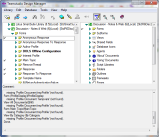
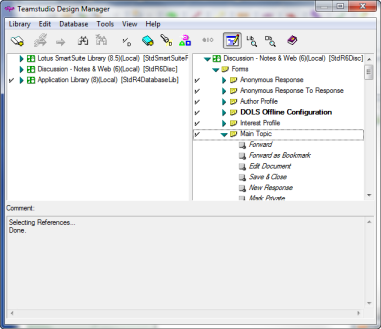

# 従属要素の識別
従属要素は別の要素が正しく機能するために必要な要素です。たとえば、サ ブフォームを使っているフォームがある場合、サブフォームがフォームの 従属要素になります。そのサブフォームがないとフォームを完全に機能さ せることはできません。要素をコピーする際、同時にコピーする必要があ る従属要素が要素にあるかどうかを考慮します。

ライブラリに再利用可能な要素が多数含まれている場合は、左側のペイン から右側のペインへと標準要素をドラッグまたはコピーするだけで、カス タマイズされたアプリケーションをすぐに作成することができます。

次の手順で、どの要素が従属要素かを表示できます。

## どの要素が従属要素かを表示するには
1. コピーする要素を選択します。
2. **[ 編集 ]** メニューから、**[ 従属要素の選択 ]** を選択します。  
   選択した要素が従属している要素には、チェックマークが付きます。  
    **[ 編集 ] > [ 従属要素の選択 ]** のショートカットとして、**[ 従属要素の選択 ]** ツー ルバーボタンを使うこともできます。  
   

## 参照を選択するには
要素参照では、どの設計要素が選択要素を参照しているかを示します。参照は、次のように選択できます。

1. 参照を選択する要素を選択します。
2. 右クリックしてショートカットメニューを表示し、[選択要素の参照を選択]を選択します。  
   選択した要素を参照するすべてのフォームが選択されています。  
   
 