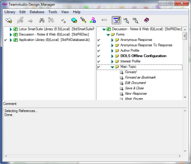

# Identifying Dependencies

A *dependency* is an element that another element requires in order to work properly. For example, if you have a form that uses a subform, the subform is a dependency of the form. The form will not work properly without the subform. When you copy an element, consider whether the element has dependencies you should also copy.

If you have a library with a number of reusable elements, you can quickly create a customized application simply by dragging or copying standard elements from the left pane to the right pane.

You can see which elements are dependencies as follows:

## To see which elements are dependencies
1. Select the element you want to copy.
2. From the **Edit** menu, choose **Select Dependencies**.  
   Elements that the element you selected is dependent on display with a checkmark.  
    Use the **Select Dependencies** toolbar button as a shortcut to the Edit** > Select Dependencies** command.  
   

## To select references
Element *references* show which design elements reference the selected element(s). You can select references as follows:

1. Select an element you want to select references for.
2. Right-click to display the short-cut menu and choose **Select Reference of Selected Elements(s)**.  
   All forms that reference the element you selected are now selected.  
   
 