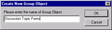
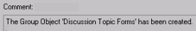
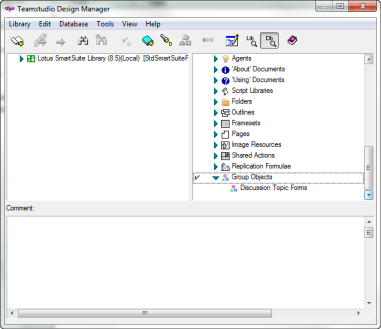
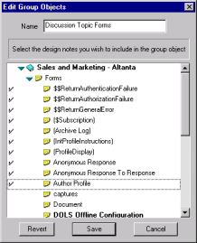

# グループオブジェクト

Design Manager を使用すると、一緒に使用する頻度が高い設計要素をまとめて、複数の設計要素のグループをデータベース設計に簡単にドラッグ・アンド・ドロップできるようになります。たとえば、顧客情報を把握する目的で一緒に使用することが多い設計ノートが複数ある場合、それを 1 つのオブジェクトにまとめて、顧客データとすることができます。

!!! note
    選択する要素すべては、同じデータベースに存在している必要があります。  
    グループオブジェクトを別のグループオブジェクトのメンバとすることはできません。  
    アクションをグループオブジェクトのメンバとすることはできません。  
    グループオブジェクトメンバは要素にする必要があります。
    
コピー履歴ログがオンになっていると、グループオブジェクトを作成、編集するたびに、グループオブジェクトの情報が記録されます。

## グループオブジェクトを作成するには
1. **CTRL** キーを押した状態で、右側のペインでグループ化する各要素をクリックします。
2. **[ データベース ]** メニューから、**[ グループオブジェクトの作成 ]** を選択します。  
    **[ データベース ]** メニューの **[ グループオブジェクトの作成 ]** のショートカットとして、**[ グループオブジェクトの作成 ]** ツールバーボタンを使うこともできます。
3. グループオブジェクト名を入力します。  
   たとえば、メイントピック、返答、返答への返答を選択し、新規グループオブジェクトを作成する場合、その名前を「ディスカッショントピックフォーム」とすることができます。  
     
   その後、Design Manager はグループオブジェクトが作成されたことをログペインに記録します。コピー履歴機能がオンになっていると、グループオブジェクトの作成の詳細とその構成要素がコピー履歴ログに記録されます。  
     
   データベースにグループオブジェクトがある場合、グループオブジェクトカテゴリがデータベースペインのカテゴリの一覧に追加されます。
4. カテゴリを展開すると、作成したグループが表示されます。
5. グループ内の要素を表示するには、グループを選択します。  
   要素の一覧がプリビューペインに表示されます。グループオブジェクトが作成されると、開いているデータベースにそのグループオブジェクトを簡単にドラッグ・アンド・ドロップすることができます。グループオブジェクトは右側のペインで作成しますが、左側のペインからのみドラッグ・アンド・ドロップできます。  
   

## グループオブジェクトの編集
グループオブジェクトを作成すると、要素の追加や削除、およびグループオブジェクトの名前の変更を行うことができます。依存関係を識別することもできます。つまり、どの要素が他の要素に従属しているかを調べることができます。

1. データベースペインの下部にある[グループオブジェクト]を展開し、作成したグループを表示します。
2. グループ名を選択し、次に**[データベース]**メニューの**[グループオブジェクトの編集 ]** を選択します。  
   **[ グループオブジェクトの編集 ]** ウィンドウが表示され、そのグループに含まれる各要素の横にチェックマークが付いています。  
   
3. 要素を選択してグループに追加するか、選択された要素の横のチェックマークを外してグループから削除します。
    1. 特定の要素に従属している要素を調べるには、その要素を右クリックし、ショートカットメニューから **[ 従属要素の識別 ]** をクリックします。  
       選択した要素とその従属要素が下線付きの青字で表示されます。従属要素を含む要素を選択すると、展開することができます。グループは変更されません。この機能は、グループへ追加する要素、または削除する要素を決めるのに役立ちます。
    2. ショートカットメニューから[従属要素を解除]を選択して、強調表示された依存関係を削除します。
4. グループオブジェクトの編集後は、次のいずれかの操作を行います。
    * 変更を保存せずに **[ グループオブジェクトの編集 ]** ウィンドウを終了するには、**[ キャンセル ]** をクリックします。
    * オリジナルのグループ定義を復元するには、**[ 戻る ]** をクリックします。**[ グループオブジェクトの編集 ]** ウィンドウは開いたままになります。
    * 変更を保存し、**[ グループオブジェクトの編集 ]** ウィンドウを終了するには、**[ 保存 ]** をクリックします。
