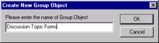
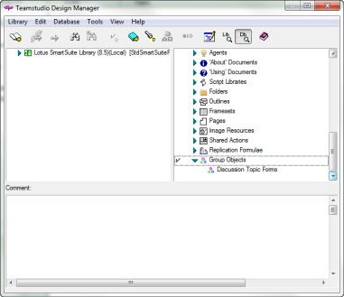

# Grouping Objects

Using Design Manager, you can group design elements that are frequently used together, making it easier to drag-and-drop a group of two or more design elements into a database design. For example, if there are several design notes you often use together to capture customer information, you can group them together to form one object you call Customer Data.

!!! note
    All selected elements must reside in the same database.  
    A group object cannot be a member of another group object.  
    Actions cannot be members of group objects.  
    Group object members must be elements.
    
If the Copy History Log is active, Design Manager records information about a group object every time you create or edit a group object.

## To Create a Group Object
1. Hold down the **CTRL** key as you click each of the elements in the right pane that you want to group together.
2. From the **Database** menu, choose **Create Group Object**.  
    Use the **Create Group Object** toolbar button as a shortcut to the **Create Group Object** command on the **Database** menu. 
3. Enter the name of the Group Object.  
   For example, if you chose Main Topic, Response and Response to Response to form a new Group Object, you may want to name that Group Object "Discussion Topic Forms."  
     
   Design Manager then records in the Log pane that the Group Object has been created. If the Copy History feature is active, Design Manager records details of the group object creation and its component elements in the Copy History Log.  
     
   If there are any group objects in a database, the Group Objects category is added to the list of categories in the Database pane.
4. Expand the category to reveal the groups you have created.
5. To view the elements in a group, select that group.  
   Its elements are listed in the preview pane. Now that the Group Object has been created, you can easily drag-and-drop the Group Object into your open database. Although you create a group object in the right pane, you can only drag and drop it from the left pane.  
   

## Editing Group Objects
Once you create a Group Object, you can add or remove elements from the group or rename the Group Object. You can also identify dependencies, that is, find out which elements are dependent on other elements.

1. Expand **Group Objects** at the bottom of the Database pane to reveal groups you have created.
2. Select a group name and then choose **Edit Group Object** from the **Database** menu.  
   You see the **Edit Group Objects** window that shows a checkmark beside each element included in the group.  
   
3. Select additional elements to add them to the group or clear checkmarks beside selected elements to remove them from the group.
    1. If you want to find out which elements are dependent on another element, right- click the element and then choose **Identify Dependencies** from the shortcut menu.  
       The element you selected and its dependent elements display as blue, underlined typeface. Selections containing those dependent elements are expanded. This does not change the group. You can use this feature to help determine what to add or remove from the group.
    2. Choose Deselect Dependencies from the shortcut menu to clear highlighted dependencies.
4. When you are finished editing the Group Object, do one of the following:
    * Click **Cancel** to exit the **Edit Group Objects** window without saving any changes.
    * Click **Revert** to restore the original group definition. The **Edit Group Objects** window remains open.
    * Click **Save** to save your changes and close the **Edit Group Objects** window.
