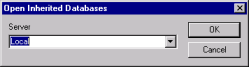

# 設計を引き継ぐデータベースを開く

設計を引き継ぐデータベースは、テンプレートから設計を引き継ぎます。テンプレートに変更を加えた場合、そのテンプレートから引き継がれたデータベースをすべて更新できます。設計を引き継ぐデータベースは、次の手順で開くことができます。

## 設計を引き継ぐデータベースを開くには
1. 左側のペインでテンプレートを選択します。
2. **[ ライブラリ ]** メニューから、**[ 設計を引き継ぐデータベースを開く ] > [ データベースレベルの引き継ぎ ]** をクリックするか、**[ 設計を引き継ぐデータベースを開く ] > [ 設計要素レベルの引き継ぎ ]** をクリックします。 
     
   [ 設計を引き継ぐデータベースを開く ] ウィンドウが表示されます。  
   
3. **[ サーバー ]** ドロップダウンで、データベースがローカル PC にある場合は **[Local]** を選択し、リモートデータベースにある場合はそのサーバーを選択して、**[OK]** をクリックします。右側のペインに、設計を引き継ぐデータベースが表示されます。

!!! note
    アクセス権のないデータベースは、右側のペインに表示されません。 