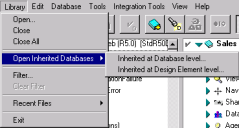
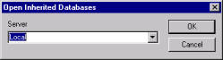

# Opening Inherited Databases

Inherited databases inherit their design from templates. If you made a change to a template, you may want to update all databases that inherit from that template.You can open inherited databases as follows:

## To open inherited databases
1. Select one or more templates in the left pane.
2. From the Library menu, click **Open Inherited Databases>Inherited at Database level** or click **Open Inherited Databases>Inherited at Design Element level**.  
     
   You see the Open** Inherited Databases** window.  
   
3. From the **Server** dropdown, select **Local** for databases that are on your PC or select a server for a remote database, then click **OK**.  
   You see the inherited databases in the right pane. 

!!! note
    Databases to which you have insufficient access will not appear in the right pane. 